# Отчёт по практической работе №3

**Тема:** Продвинутые техники Git: Rebase, Squash, конфликты и Multi-Remote  
**Студент:** Капустин Глеб  
**Группа:** ЭФБО-10-24

## Задание 1. Разрешение merge-конфликта

В двух параллельных ветках были созданы разные версии `README.md`. При слиянии Git обнаружил add/add-конфликт. Содержимое обеих версий было осмысленно объединено, а маркеры конфликта удалены.

### До разрешения

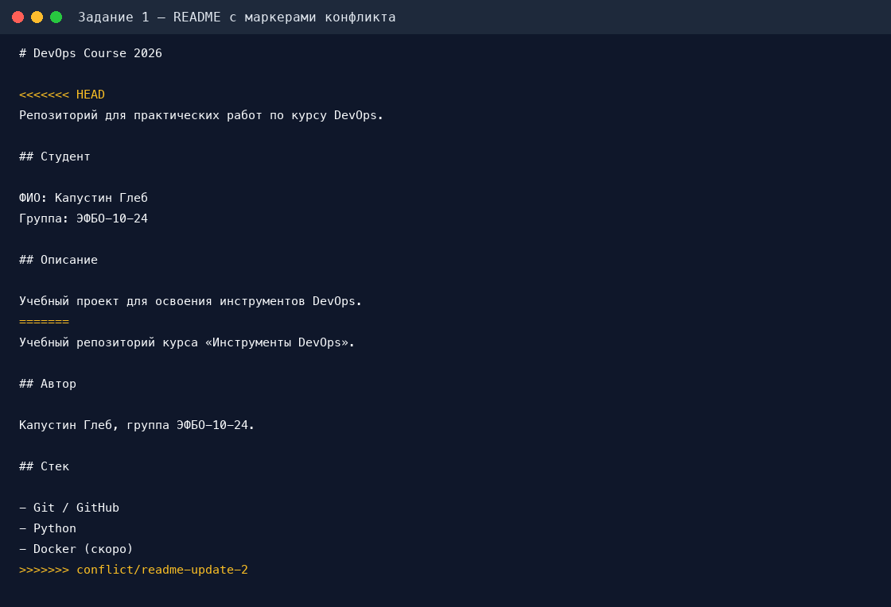

### После разрешения

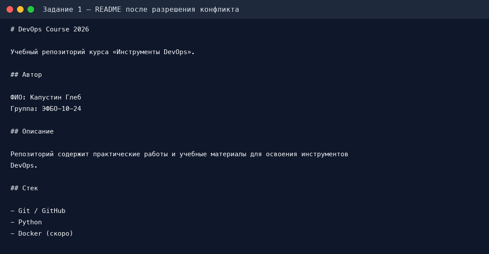

## Задание 2. Merge и Rebase

### История после merge

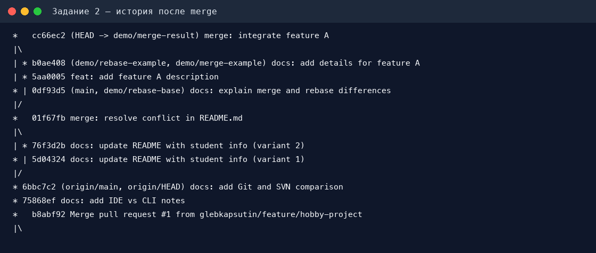

При `merge` сохраняются обе линии разработки и создаётся отдельный merge-коммит. История точно отражает параллельную работу, но становится разветвлённой.

### История после rebase

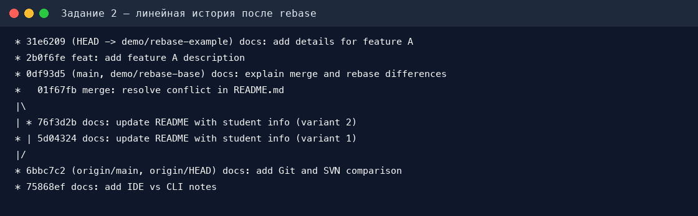

При `rebase` коммиты feature-ветки были перенесены поверх актуального `main`. История стала линейной и читается последовательно, без дополнительного merge-коммита.

## Задание 3. Interactive Rebase

### История до rebase

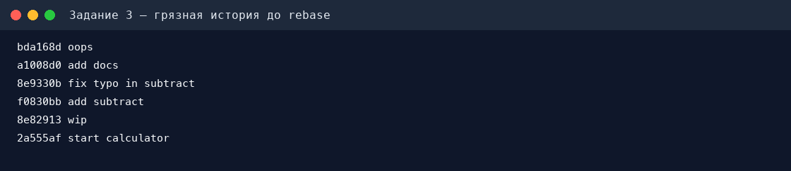

### История после rebase

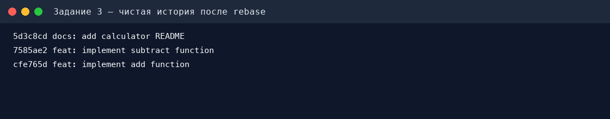

Через interactive rebase были выполнены `fixup` для рабочих исправлений, `drop` для пустого коммита и переименование итоговых коммитов по Conventional Commits.

### Итоговый calculator.py

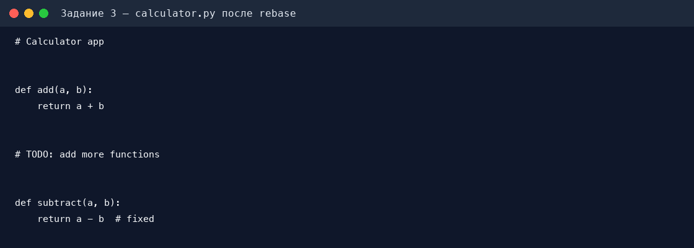

## Задание 4. Multi-Remote

Для репозитория используются два удалённых адреса:

- `origin` — основной репозиторий `glebkapsutin/devops-course-2026`;
- `mirror` — резервный репозиторий `glebkapsutin/devops-course-2026-mirror`.

После создания зеркала все ветки и теги отправляются в оба репозитория, а тестовый коммит проверяет синхронизацию.

## Задание 5. Cherry-pick, Reflog и Revert

### Cherry-pick

Из ветки `hotfix/urgent-fix` в `main` был перенесён только критический фикс. Экспериментальные функции `multiply` и `divide` в `main` не попали.

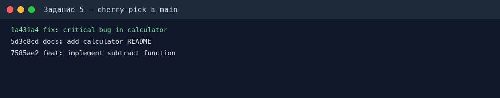

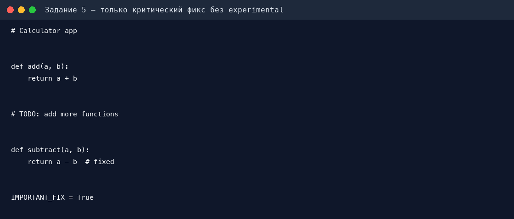

### Reflog

Ветка с `important_data.md` была удалена, после чего хеш потерянного коммита найден через `git reflog`. Из этого хеша временно создана восстановленная ветка, а содержимое файла успешно прочитано.

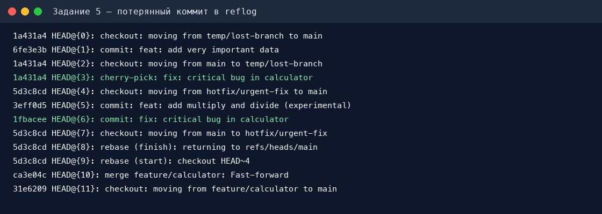

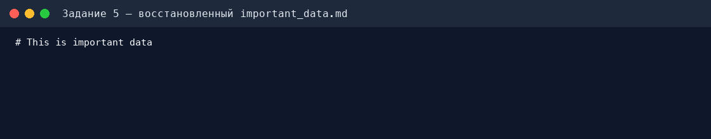

### Revert

После добавления строки `BROKEN_CODE` выполнен `git revert`. В истории сохранились и вредный коммит, и отдельный коммит отмены; при этом ошибочная строка исчезла из файла.

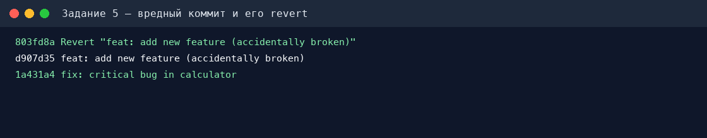

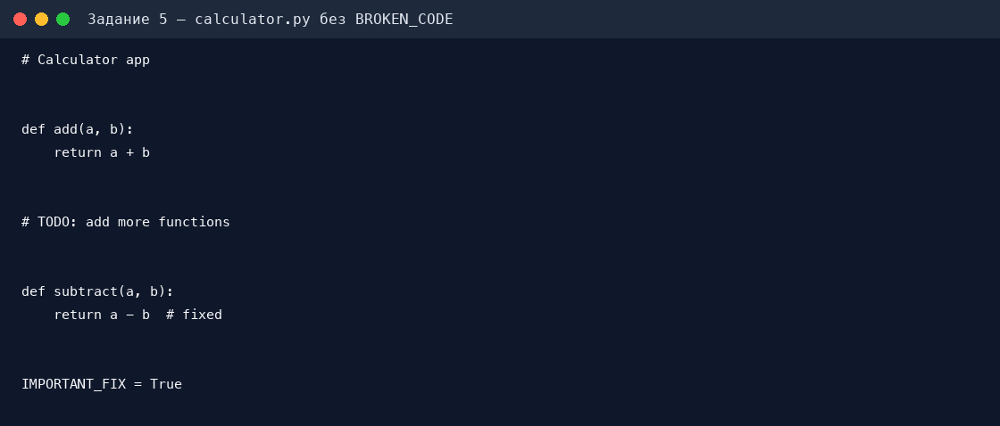

## Бонус. Git hook для Conventional Commits

В репозитории добавлен `commit-msg` hook. Он проверяет формат сообщения и принимает типы `feat`, `fix`, `docs`, `chore`, `refactor`, `merge`, `test`, `ci`, `build`, `perf` и `style`.

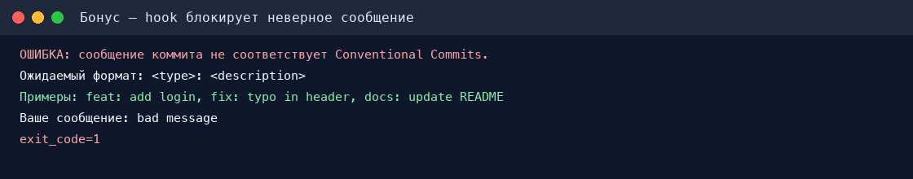

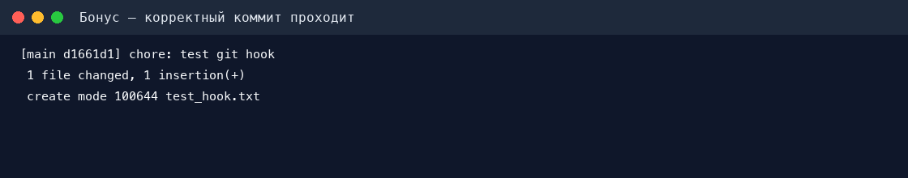

## Вывод

В ходе работы были отработаны конфликты слияния, стратегии merge и rebase, очистка истории через interactive rebase, выборочный перенос изменений через cherry-pick, восстановление потерянного коммита с помощью reflog, безопасная отмена изменений через revert и контроль сообщений коммитов с помощью Git hook.
